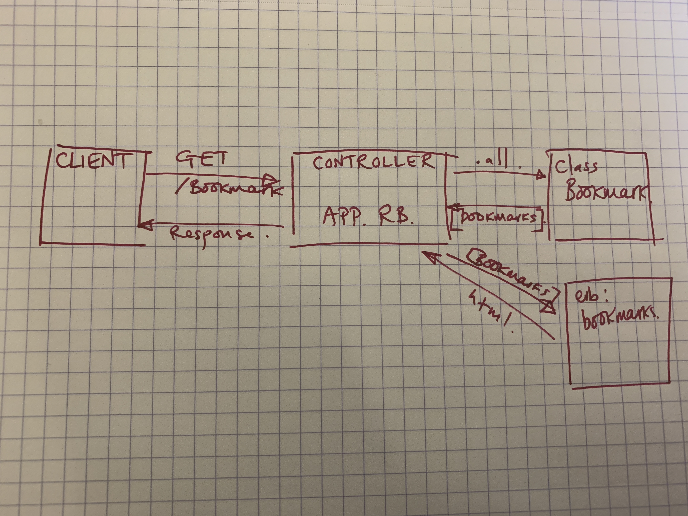

# Bookmarks manager

## User Stories

```
As a user
So that I can go to websites I visit regularly
I want to be able to see a list of bookmarks
```
```
As a user
So that I can bookmark a new website
I want to be able to add a URL to my list of bookmarks
```
### Domain Model



### Database setup

<!-- * Connect to psql
* Create the database using the `psql` command `CREATE DATABASE bookmark_manager;`
* Connect to the database using the `pqsl` command `\c bookmark_manager;`
* Run the query we have saved in the file `01_create_bookmarks_table.sql` -->

Connect to `psql` and create the `bookmark_manager` and `bookmark_manager_test` databases:
 ```
CREATE DATABASE bookmark_manager;
CREATE DATABASE bookmark_manager_test;
```
To set up the appropriate tables, connect to each database in `psql` and run the SQL scripts in the `db/migrations` folder in the given order.

### To run the Bookmark Manager app:

  ```
 rackup -p 3000
 ```

 To view bookmarks, navigate to `localhost:3000/bookmarks`.

### To run tests:

 ```
 rspec
 ```

 ### To run linting:

 ```
 rubocop
 ```
